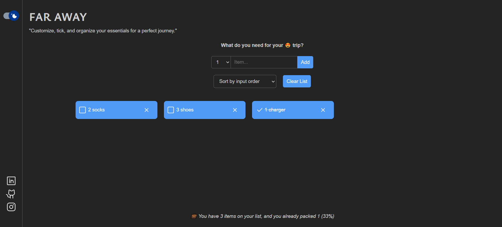
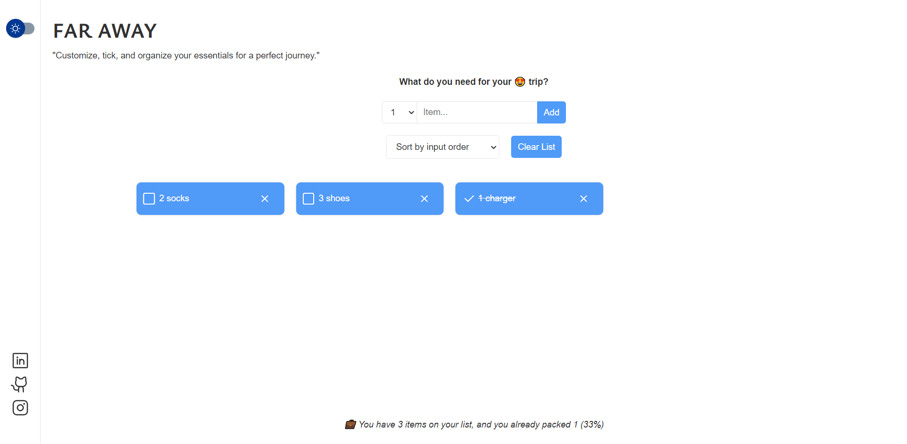

# React Travel List App

This project is developed using React, SCSS. It is a travel list application where users can add items they need for their trips using a form. They can specify the quantity for each item and can also check or delete the items they have added. The travel list items can be sorted using various options, and the entire list can be reset, starting from scratch. The project also includes a toggle button for switching between dark mode and light mode, with the dark mode implemented professionally using SCSS.

## Table of contents

- [Overview](#overview)
  - [Features](#the-challenge)
  - [Screenshot](#screenshot)
  - [Links](#links)
- [My process](#my-process)
  - [Built with](#built-with)
- [Author](#author)

## Overview

### Features

- Users can add travel items to the list.
- Users can specify the quantity for each item.
- Users can check or delete items from the list.
- Travel list items can be sorted using different options.
- Users can reset the entire list and start over.
- The application includes a toggle button for switching between dark mode and light mode.

### Screenshot

### Links

- Live on: [Netlify](https://react-travel-list.netlify.app/)

## My process

### Built with

- React
- SCSS
- Sweet Alert

## Author

- Linkedin - [@parham-tavakolian](https://www.linkedin.com/in/parham-tavakolian/)
